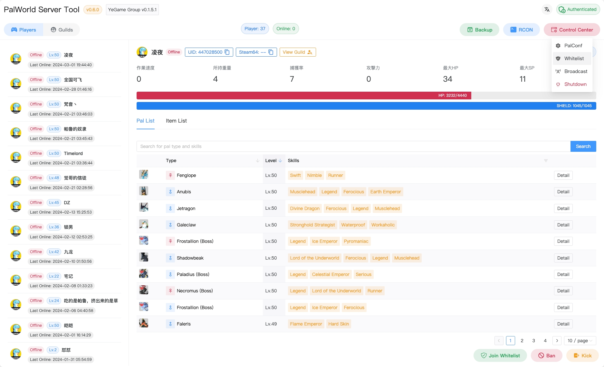
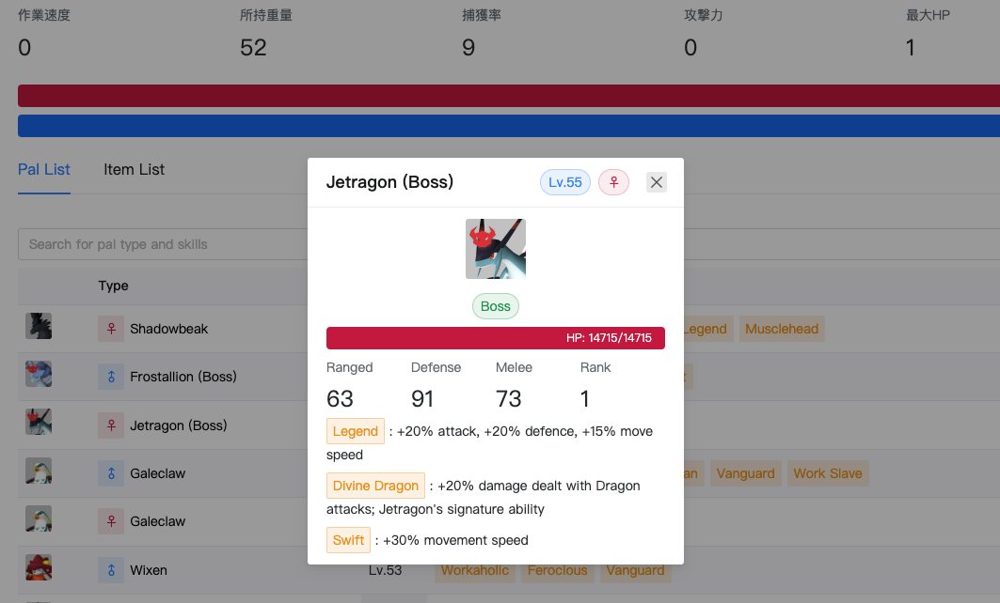
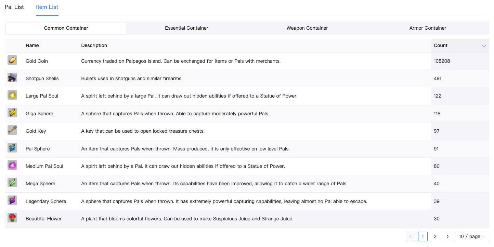

<h1 align='center'>PalWorld Server Tool</h1>

<p align="center">
   <a href="/README.md">简体中文</a> | <strong>English</strong>
</p>

<p align='center'> 
  Manage your Palworld dedicated server through a visual interface and REST API, using SAV file parsing and RCON functionalities.<br/>
  And it took a long and boring time to i18n...
</p>

<p align='center'>
<a href="#">
  
</a>&nbsp;&nbsp;
<a href="#">
  
</a>&nbsp;&nbsp;
<a href="#">
  
</a>&nbsp;&nbsp;
<a href="#">
  
</a>&nbsp;&nbsp;
</p>



The mobile interface is adapting

Features and roadmap based on parsing of `Level.sav` save files:

- [x] Complete player data
- [x] Player Palworld data
- [x] Guild data
- [ ] Player inventory data

Features implemented using official RCON commands (available only for servers):

- [x] Retrieve server information
- [x] Online player list
- [x] Kick/ban players
- [x] In-game broadcasting
- [x] Smooth server shutdown with broadcast message

This tool uses bbolt for single file storage, fetching and saving data from RCON and Level.sav files via scheduled tasks. It provides a simple visual interface and REST API for easy management and development.

Due to limited maintenance and development staff, we welcome front-end, back-end developers, and even data engineers to submit PRs!

## Download

> [!CAUTION]
> The task of parsing `Level.sav` requires **significant system memory (often 4GB-6GB) in a short period (about 1-3min)** , this portion of memory is released after the parsing task is completed. Ensure your server has enough memory! If not, consider syncing the save files to your personal computer via [rsync](https://github.com/WayneD/rsync) for running.**The file synchronization Agent tool between the tool and the host will be develop later to achieve deployment separation.**

Download the latest executable files at:

- [Github Releases](https://github.com/zaigie/palworld-server-tool/releases)

## Function screenshot

https://github.com/zaigie/palworld-server-tool/assets/17232619/42d4c5db-8799-4962-b762-ae22eebbfeb9






## How to Enable RCON for Private Servers

You need to enable RCON functionality on your server. If your private server tutorial includes this, great. If not, modify the `PalWorldSettings.ini` file.

**This is the file where various in-game multipliers and probabilities are set.** At the end of the file, you'll find:

```txt
AdminPassword=...,...,RCONEnabled=true,RCONPort=25575
```


Please **shut down the server before making modifications**. Set an AdminPassword, and fill in `RCONEnabled` and `RCONPort` as shown above. Then restart the server.

## Installation and Deployment

### Linux

#### Download and Extract

```bash
# Download pst_{version}_{platform}_{arch}.tar.gz and extract to the pst directory
mkdir -p pst && tar -xzf pst_v0.4.2_linux_amd64.tar.gz -C pst
```

#### Configuration

1. Open the directory and allow execution

   ```bash
   cd pst
   chmod +x pst sav_cli
   ```

2. Find the `config.yaml` file and modify it as per the instructions.

   For `decode_path`, it's usually the pst directory plus `sav_cli`. If unsure about the absolute path, execute `pwd` in the terminal.

   ```yaml
   web: # web configuration
     password: "" # web management mode password
     port: 8080 # web service port
   rcon: # RCON configuration
     address: "127.0.0.1:25575" # RCON address
     password: "" # Set AdminPassword
     timeout: 5 # RCON request timeout, recommended <= 5
     sync_interval: 60 # Interval for syncing online player status with RCON service, in seconds
   save: # Save file parsing configuration
     path: "/path/to/you/Level.sav" # Save file path
     decode_path: "/path/to/your/sav_cli" # Save file parsing tool path, usually in the same directory as pst
     sync_interval: 600 # Interval for syncing data from save file, in seconds, recommended >= 600
   ```

#### Run

```bash
./pst
```

```log
2024/01/31 - 22:39:20 | INFO | palworld-server-tool/main.go:75 | Starting PalWorld Server Tool...
2024/01/31 - 22:39:20 | INFO | palworld-server-tool/main.go:76 | Version: Develop
2024/01/31 - 22:39:20 | INFO | palworld-server-tool/main.go:77 | Listening on http://127.0.0.1:8080 or http://192.168.1.66:8080
2024/01/31 - 22:39:20 | INFO | palworld-server-tool/main.go:78 | Swagger on http://127.0.0.1:8080/swagger/index.html
```

For background operation (running after SSH window is closed):

```bash
# Run in the background and save the log in server.log
nohup ./pst > server.log 2>&1 &
# To view logs
tail -f server.log
```

#### Stopping Background Process

```bash
kill $(ps aux | grep 'pst' | awk '{print $2}') | head -n 1
```

#### Access

Access via browser at http://127.0.0.1:8080 or http://{Local Network IP}:8080

Access at http://{Server IP}:8080 after opening firewall and security group in cloud servers.

> [!WARNING]
> If you open the file for the first time, nothing will be displayed. Please **wait until the first sav archive synchronization is complete**
>
> If your server configuration is sufficient and performance is good, you can try to make `save.sync_interval` shorter, the default is 600s (10min).

### Windows

#### Download and Extract

Extract `pst_v0.4.2_windows_x86.zip` to any directory (recommend naming the folder `pst`).

#### Configuration

Find the `config.yaml` file in the extracted directory and modify it according to the instructions.

For `decode_path`, it's typically the pst directory plus `sav_cli.exe`.

You can also right-click - "Properties", view the path and file name, and then concatenate them. (Same for archive file path and tool path)


> [!WARNING]
> Instead of pasting the copied path directly into `config.yaml`, add another '\\' in front of all '\\', as shown below

```yaml
web: # web configuration
  password: "" # web management mode password
  port: 8080 # web service port
rcon: # RCON configuration
  address: "127.0.0.1:25575" # RCON address
  password: "" # Set AdminPassword
  timeout: 5 # RCON request timeout, recommended <= 5
  sync_interval: 60 # Interval for syncing online player status with RCON service, in seconds
save: # Save file parsing configuration
  path: "C:\\path\\to\\you\\Level.sav" # Save file path
  decode_path: "C:\\path\\to\\your\\sav_cli.exe" # Save file parsing tool path, usually in the same directory as pst
  sync_interval: 600 # Interval for syncing data from save file, in seconds, recommended >= 600
```

#### Running

Two ways to run on Windows:

1. start.bat (Recommended)

   Find and double-click the `start.bat` file in the extracted directory.

2. Press `Win + R`, enter `powershell` to open Powershell, navigate to the directory of the downloaded executable file using the `cd` command.

   ```powershell
   .\pst.exe
   ```

```log
2024/01/31 - 22:39:20 | INFO | palworld-server-tool/main.go:75 | Starting PalWorld Server Tool...
2024/01/31 - 22:39:20 | INFO | palworld-server-tool/main.go:76 | Version: Develop
2024/01/31 - 22:39:20 | INFO | palworld-server-tool/main.go:77 | Listening on http://127.0.0.1:8080 or http://192.168.31.214:8080
2024/01/31 - 22:39:20 | INFO | palworld-server-tool/main.go:78 | Swagger on http://127.0.0.1:8080/swagger/index.html
```

If you see the preceding interface, it indicates that the operation is successful. Keep the window open.

#### Access

Access via browser at http://127.0.0.1:8080 or http://{Local Network IP}:8080

Access at http://{Server IP}:8080 after opening firewall and security group in cloud servers.

> [!WARNING]
> If you open the file for the first time, nothing will be displayed. Please **wait until the first sav archive synchronization is complete**
>
> If your server configuration is sufficient and performance is good, you can try to make `save.sync_interval` shorter, the default is 600s (10min).

## REST API Document

[APIFox Online document](https://q4ly3bfcop.apifox.cn/)

## LICENSE

According to the [Apache2.0 LICENSE](LICENSE) authorization, any reprints please indicate in the README and document section! Any commercial behavior must be informed!
