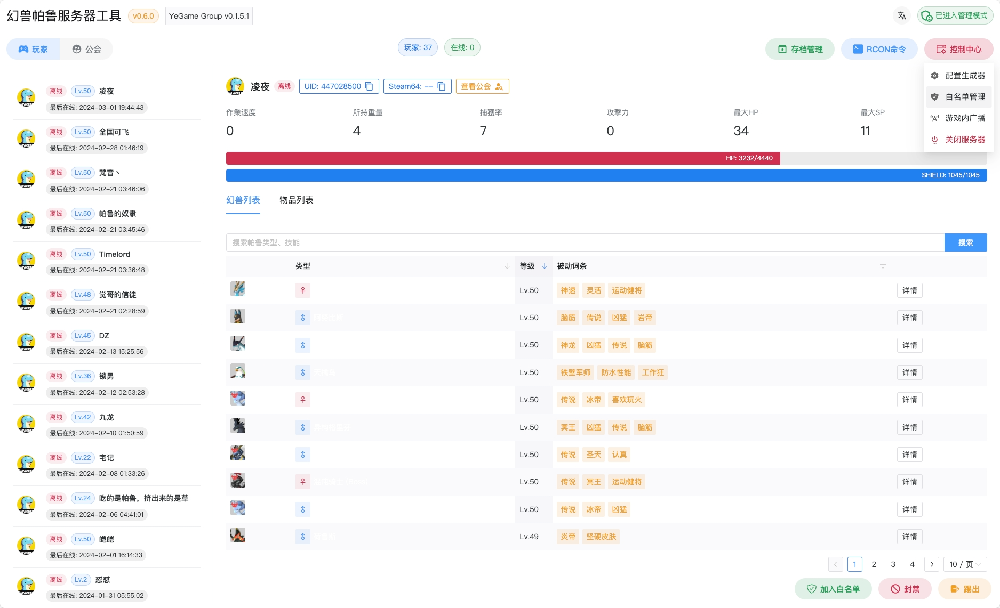
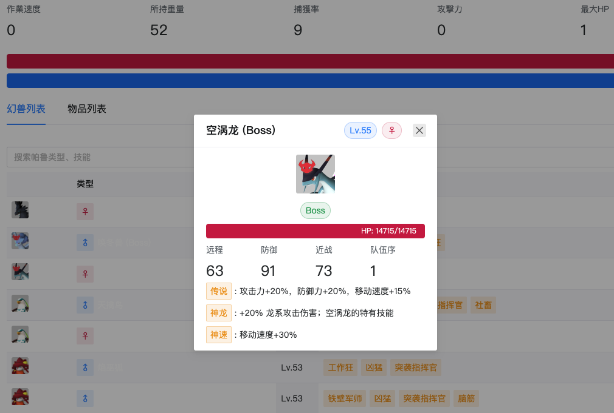
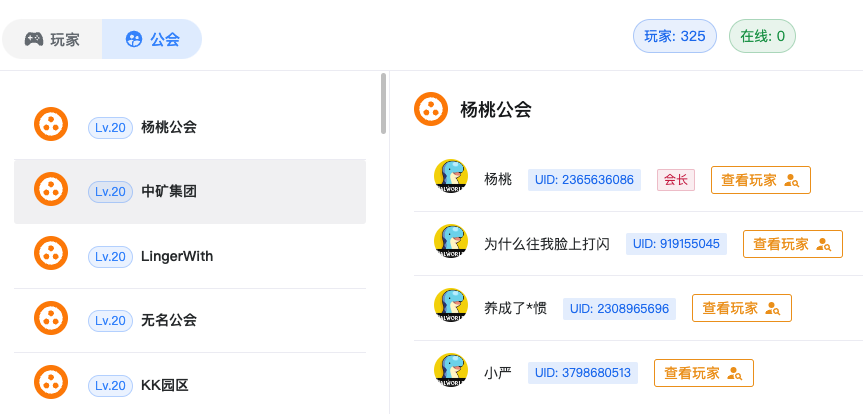

<h1 align='center'>幻兽帕鲁服务器管理工具</h1>

<p align="center">
   <strong>简体中文</strong> | <a href="/README.en.md">English</a>
</p>

<p align='center'> 
  通过可视化界面及 REST 接口管理幻兽帕鲁专用服务器，基于 SAV 存档文件解析及 RCON 实现<br/>
  并且花了很漫长且枯燥的时间去做了国际化...
</p>

<p align='center'>
<a href="#">
  
</a>&nbsp;&nbsp;
<a href="#">
  
</a>&nbsp;&nbsp;
<a href="#">
  
</a>&nbsp;&nbsp;
<a href="#">
  
</a>&nbsp;&nbsp;
</p>



移动端界面适配中

基于 `Level.sav` 存档文件解析实现的功能及路线图：

- [x] 完整玩家数据
- [x] 玩家帕鲁数据
- [x] 公会数据
- [ ] 玩家背包数据

基于官方提供的 RCON 命令（仅服务器可用的）实现功能：

- [x] 获取服务器信息
- [x] 在线玩家列表
- [x] 踢出/封禁玩家
- [x] 游戏内广播
- [x] 平滑关闭服务器并广播消息

本工具使用 bblot 单文件存储，将 RCON 和 Level.sav 文件的数据通过定时任务获取并保存，提供简单的可视化界面和 REST 接口和便于管理与开发。

由于维护开发人员较少，虽有心但力不足，欢迎各前端和后端甚至数据工程师来提交 PR！

> `sav_cli` 由于一些原因暂时没有开源，但将会在近期整理并开源。

## 下载

> [!CAUTION]
> 解析 `Level.sav` 存档的任务需要在**短时间（1-3 分钟）耗费较大的系统内存**（常常是 4GB~6GB），这部分内存会在执行完解析任务后释放，因此你至少需要确保你的服务器有充足的内存！若不满足条件仍需使用，你可以考虑在个人电脑上通过配置 [rsync](https://github.com/WayneD/rsync) 自动同步存档文件来运行。**后面会开发工具和主机之间的文件同步 Agent 工具，实现部署分离**。

请在以下地址下载最新版可执行文件

- [Github Releases](https://github.com/zaigie/palworld-server-tool/releases)
- [(国内) Gitee Releases](https://gitee.com/jokerwho/palworld-server-tool/releases)

## 功能截图

https://github.com/zaigie/palworld-server-tool/assets/17232619/7a861091-94ee-4efe-8274-15df261d50b4






## 如何开启私服 RCON

需要开启服务器的 RCON 功能，如果你的私服教程有写更好，没有的话，修改 `PalWorldSettings.ini` 文件

**也就是修改游戏内各种倍数、概率的那个文件**，里面最后的位置有如下：

```txt
AdminPassword=...,...,RCONEnabled=true,RCONPort=25575
```


请**先关闭服务器再作修改**，你需要设置一个 AdminPassword，然后将 `RCONEnabled` 和 `RCONPort` 填写如上，再重启服务器即可。

## 安装部署

### Linux

#### 下载解压

```bash
# 下载 pst_{version}_{platform}_{arch}.tar.gz 文件并解压到 pst 目录
mkdir -p pst && tar -xzf pst_v0.4.0_linux_amd64.tar.gz -C pst
```

#### 配置

1. 打开目录并允许可执行

   ```bash
   cd pst
   chmod +x pst sav_cli
   ```

2. 找到其中的 `config.yaml` 文件并按照说明修改。

   关于其中的 `decode_path`，一般就是解压后的 pst 目录加上 `sav_cli` ，如果不知道绝对路径，在终端执行 `pwd` 即可

   ```yaml
   web: # web 相关配置
     password: "" # web 管理模式密码
     port: 8080 # web 服务端口
   rcon: # RCON 相关配置
     address: "127.0.0.1:25575" # RCON 地址
     password: "" # 设置的 AdminPassword
     timeout: 5 # 请求 RCON 超时时间，推荐 <= 5
     sync_interval: 60 # 定时向 RCON 服务获取玩家在线情况的间隔，单位秒
   save: # 存档文件解析相关配置
     path: "/path/to/you/Level.sav" # 存档文件路径
     decode_path: "/path/to/your/sav_cli" # 存档解析工具路径，一般和 pst 在同一目录
     sync_interval: 600 # 定时从存档获取数据的间隔，单位秒，推荐 >= 600
   ```

#### 运行

```bash
./pst
```

```log
2024/01/31 - 22:39:20 | INFO | palworld-server-tool/main.go:75 | Starting PalWorld Server Tool...
2024/01/31 - 22:39:20 | INFO | palworld-server-tool/main.go:76 | Version: Develop
2024/01/31 - 22:39:20 | INFO | palworld-server-tool/main.go:77 | Listening on http://127.0.0.1:8080 or http://192.168.1.66:8080
2024/01/31 - 22:39:20 | INFO | palworld-server-tool/main.go:78 | Swagger on http://127.0.0.1:8080/swagger/index.html
```

若需要后台运行（关闭 ssh 窗口后仍运行）

```bash
# 后台运行并将日志保存在 server.log
nohup ./pst > server.log 2>&1 &
# 查看日志
tail -f server.log
```

#### 关闭后台运行

```bash
kill $(ps aux | grep 'pst' | awk '{print $2}') | head -n 1
```

#### 访问

请通过浏览器访问 http://127.0.0.1:8080 或 http://{局域网 IP}:8080

云服务器开放防火墙及安全组后也可以访问 http://{服务器 IP}:8080

> [!WARNING]
> 初次打开会显示空白没有内容，请**等待第一次 sav 存档同步完成**再访问

### Windows

#### 下载解压

解压 `pst_v0.4.0_windows_x86.zip` 到任意目录（推荐命名文件夹目录名称为 `pst`）

#### 配置

找到解压目录中的 `config.yaml` 文件并按照说明修改。

关于其中的 `decode_path`，一般就是解压后的 pst 目录加上 `sav_cli.exe`

你也可以直接鼠标右键——“属性”，查看路径和文件名，再将它们拼接起来。（存档文件路径和工具路径同理）


> [!WARNING]
> 请不要直接将复制的路径粘贴到 `config.yaml` 中，而是需要在所有的 '\\' 前面再加一个 '\\'，像下面展示的一样

```yaml
web: # web 相关配置
  password: "" # web 管理模式密码
  port: 8080 # web 服务端口
rcon: # RCON 相关配置
  address: "127.0.0.1:25575" # RCON 地址
  password: "" # 设置的 AdminPassword
  timeout: 5 # 请求 RCON 超时时间，推荐 <= 5
  sync_interval: 60 # 定时向 RCON 服务获取玩家在线情况的间隔，单位秒
save: # 存档文件解析相关配置
  path: "C:\\path\\to\\you\\Level.sav" # 存档文件路径
  decode_path: "C:\\path\\to\\your\\sav_cli.exe" # 存档解析工具路径，一般和 pst 在同一目录
  sync_interval: 600 # 定时从存档获取数据的间隔，单位秒，推荐 >= 600
```

#### 运行

这里有两种方式可以在 Windows 下运行

1. start.bat（推荐）

   找到解压目录下的 `start.bat` 文件，双击运行

2. 按下 `Win + R`，输入 `powershell` 打开 Powershell，通过 `cd` 命令到下载的可执行文件目录

   ```powershell
   .\pst.exe
   ```

```log
2024/01/31 - 22:39:20 | INFO | palworld-server-tool/main.go:75 | Starting PalWorld Server Tool...
2024/01/31 - 22:39:20 | INFO | palworld-server-tool/main.go:76 | Version: Develop
2024/01/31 - 22:39:20 | INFO | palworld-server-tool/main.go:77 | Listening on http://127.0.0.1:8080 or http://192.168.31.214:8080
2024/01/31 - 22:39:20 | INFO | palworld-server-tool/main.go:78 | Swagger on http://127.0.0.1:8080/swagger/index.html
```

看到上述界面表示成功运行，请保持窗口打开

#### 访问

请通过浏览器访问 http://127.0.0.1:8080 或 http://{局域网 IP}:8080

云服务器开放防火墙及安全组后也可以访问 http://{服务器 IP}:8080

> [!WARNING]
> 初次打开会显示空白没有内容，请**等待第一次 sav 存档同步完成**再访问

## 接口文档

[APIFox 在线接口文档](https://q4ly3bfcop.apifox.cn/)

## 许可证

根据 [Apache2.0 许可证](LICENSE) 授权，任何转载请在 README 和文件部分标明！任何商用行为请务必告知！
